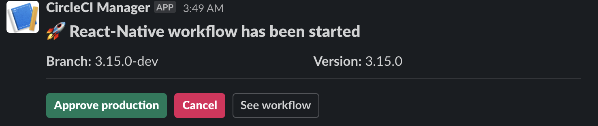
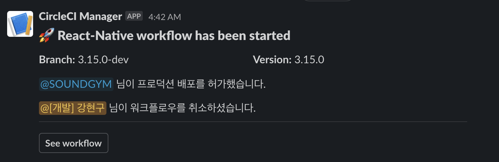

## Environment variable setup
Environment variables are required for Network request.

CircleCI token - https://app.circleci.com/settings/user/tokens<br/>
Slack Incoming hook url - https://api.slack.com/messaging/webhooks#posting_with_webhooks

```dotenv
SLACK_HOOK_URL=
CIRCLECI_TOKEN=
APPROVAL_JOB_NAME=
```


## Feature

### Support approve job and cancel workflow in slack


### Tracking user who performed actions

